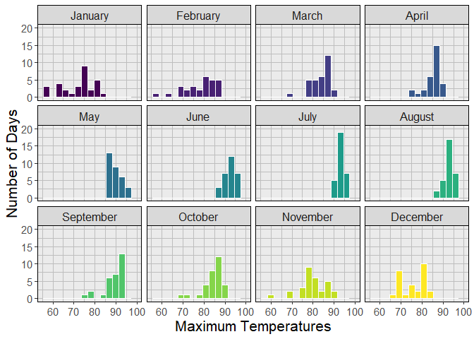
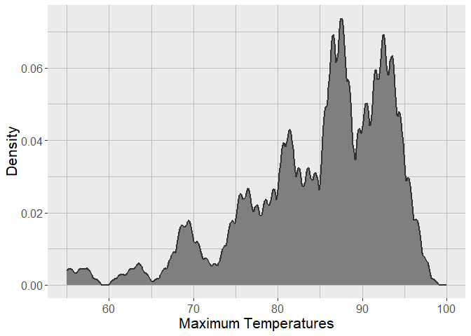
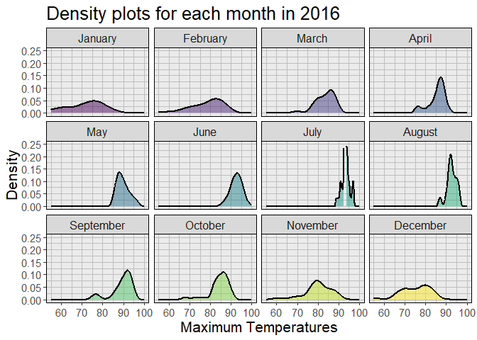
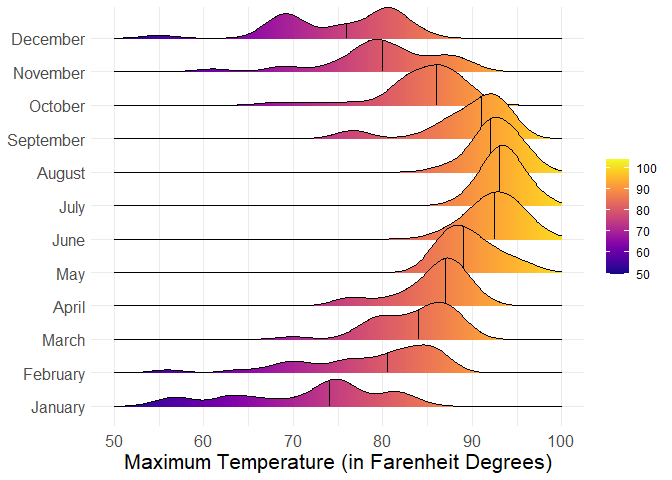
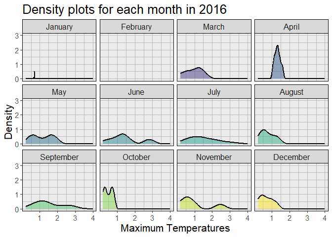
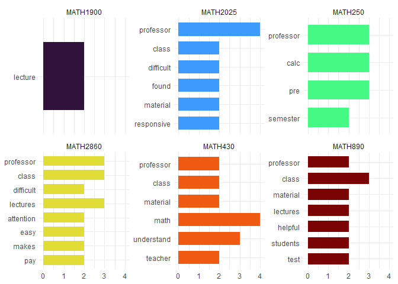

# Data Visualization Project 03


In this exercise you will explore methods to create different types of data visualizations (such as plotting text data, or exploring the distributions of continuous variables).


## PART 1: Density Plots

Using the dataset obtained from FSU's [Florida Climate Center](https://climatecenter.fsu.edu/climate-data-access-tools/downloadable-data), for a station at Tampa International Airport (TPA) for 2022, attempt to recreate the charts shown below which were generated using data from 2016. You can read the 2022 dataset using the code below: 


```r
library(tidyverse)
```

```
## ── Attaching core tidyverse packages ──────────────────────── tidyverse 2.0.0 ──
## ✔ dplyr     1.1.4     ✔ readr     2.1.5
## ✔ forcats   1.0.0     ✔ stringr   1.5.1
## ✔ ggplot2   3.5.0     ✔ tibble    3.2.1
## ✔ lubridate 1.9.3     ✔ tidyr     1.3.1
## ✔ purrr     1.0.2     
## ── Conflicts ────────────────────────────────────────── tidyverse_conflicts() ──
## ✖ dplyr::filter() masks stats::filter()
## ✖ dplyr::lag()    masks stats::lag()
## ℹ Use the conflicted package (<http://conflicted.r-lib.org/>) to force all conflicts to become errors
```

```r
library(viridis)
```

```
## Loading required package: viridisLite
```

```r
library(ggridges)
weather_tpa <- read_csv("https://raw.githubusercontent.com/reisanar/datasets/master/tpa_weather_2022.csv")
```

```
## Rows: 365 Columns: 7
## ── Column specification ────────────────────────────────────────────────────────
## Delimiter: ","
## dbl (7): year, month, day, precipitation, max_temp, min_temp, ave_temp
## 
## ℹ Use `spec()` to retrieve the full column specification for this data.
## ℹ Specify the column types or set `show_col_types = FALSE` to quiet this message.
```

```r
# random sample 
weather_tpa
```

```
## # A tibble: 365 × 7
##     year month   day precipitation max_temp min_temp ave_temp
##    <dbl> <dbl> <dbl>         <dbl>    <dbl>    <dbl>    <dbl>
##  1  2022     1     1       0             82       67     74.5
##  2  2022     1     2       0             82       71     76.5
##  3  2022     1     3       0.02          75       55     65  
##  4  2022     1     4       0             76       50     63  
##  5  2022     1     5       0             75       59     67  
##  6  2022     1     6       0.00001       74       56     65  
##  7  2022     1     7       0.00001       81       63     72  
##  8  2022     1     8       0             81       58     69.5
##  9  2022     1     9       0             84       65     74.5
## 10  2022     1    10       0             81       64     72.5
## # ℹ 355 more rows
```

See https://www.reisanar.com/slides/relationships-models#10 for a reminder on how to use this type of dataset with the `lubridate` package for dates and times (example included in the slides uses data from 2016).

Using the 2022 data: 

(a) Create a plot like the one below:


```r
#keeping sample image plot for reference.
knitr::include_graphics("https://github.com/reisanar/figs/raw/master/tpa_max_temps_facet.png")
```


```r
#firstly, wrangling data
tpa_clean <- weather_tpa %>% 
  unite("doy", year, month, day, sep = "-") %>% 
  mutate(doy = ymd(doy), 
         max_temp = as.double(max_temp), 
         min_temp = as.double(min_temp), 
         precipitation = as.double(precipitation)) %>%
   mutate(month = month(floor_date(doy, "month"), label = TRUE, abbr = FALSE))

tpa_clean
```

```
## # A tibble: 365 × 6
##    doy        precipitation max_temp min_temp ave_temp month  
##    <date>             <dbl>    <dbl>    <dbl>    <dbl> <ord>  
##  1 2022-01-01       0             82       67     74.5 January
##  2 2022-01-02       0             82       71     76.5 January
##  3 2022-01-03       0.02          75       55     65   January
##  4 2022-01-04       0             76       50     63   January
##  5 2022-01-05       0             75       59     67   January
##  6 2022-01-06       0.00001       74       56     65   January
##  7 2022-01-07       0.00001       81       63     72   January
##  8 2022-01-08       0             81       58     69.5 January
##  9 2022-01-09       0             84       65     74.5 January
## 10 2022-01-10       0             81       64     72.5 January
## # ℹ 355 more rows
```

```r
#plot seems to be facet wrapped for each month using viridis histograms for max temps over number of days, binwidth is 3
monthlytempplot <- ggplot(tpa_clean, aes(x = max_temp, fill = month)) +
  geom_histogram(binwidth = 3,  col="white", color = month) +
  scale_x_continuous(limits = c(55, 100))+
  scale_y_continuous(limits = c(0, 20))+
  scale_fill_viridis(discrete = TRUE) +
  facet_wrap(~ month, scales = "fixed")+
  
  
  labs(x = "Maximum Temperatures", y = "Number of Days") +
  theme(legend.position = "none") +
  theme(axis.text.y = element_text(size = 11), axis.text.x = element_text(size = 11), axis.title = element_text(size=16), panel.grid.major = element_line(color = "grey"), panel.grid.minor = element_line(color = "grey"))+
  theme(panel.border = element_rect(color="black", fill=NA), strip.background=element_rect(colour="black"), strip.text = element_text(size = 12))
```

```
## Warning: Duplicated aesthetics after name standardisation: colour
```

```r
monthlytempplot
```

```
## Warning: Removed 2 rows containing non-finite outside the scale range
## (`stat_bin()`).
```

```
## Warning: Removed 24 rows containing missing values or values outside the scale range
## (`geom_bar()`).
```



Hint: the option `binwidth = 3` was used with the `geom_histogram()` function.

(b) Create a plot like the one below:


```r
knitr::include_graphics("https://github.com/reisanar/figs/raw/master/tpa_max_temps_density.png")
```


```r
densityplot <- ggplot(tpa_clean, aes(x=max_temp)) + 
  geom_density(kernel = "epanechnikov", bw = 0.5, color="#323232", fill = "#7f7f7f", size = 1) +
  scale_x_continuous(limits = c(55, 100)) +
  labs(x = "Maximum Temperatures", y = "Density") +
  theme(axis.text.y = element_text(size = 12), axis.text.x = element_text(size = 12), axis.title = element_text(size=16), panel.grid.major = element_line(color = "grey"), panel.grid.minor = element_line(color = "grey"))
```

```
## Warning: Using `size` aesthetic for lines was deprecated in ggplot2 3.4.0.
## ℹ Please use `linewidth` instead.
## This warning is displayed once every 8 hours.
## Call `lifecycle::last_lifecycle_warnings()` to see where this warning was
## generated.
```

```r
densityplot
```

```
## Warning: Removed 2 rows containing non-finite outside the scale range
## (`stat_density()`).
```



Hint: check the `kernel` parameter of the `geom_density()` function, and use `bw = 0.5`.

(c) Create a plot like the one below:


```r
knitr::include_graphics("https://github.com/reisanar/figs/raw/master/tpa_max_temps_density_facet.png")
```


```r
monthlydensityplot <- ggplot(tpa_clean, aes(x=max_temp, fill = month)) + 
  geom_density(alpha = 0.5, size = 0.75, kernel = "cosine") +
  scale_fill_viridis(discrete = TRUE) +
  scale_x_continuous(limits = c(55, 100)) +
  scale_y_continuous(limits = c(0, 0.25)) +
  labs(x = "Maximum Temperatures", y = "Density") +
  theme(axis.text.y = element_text(size = 12), axis.text.x = element_text(size = 12), axis.title = element_text(size=16), panel.grid.major = element_line(color = "grey"), panel.grid.minor = element_line(color = "grey")) +
  facet_wrap(~ month, scales = "fixed")+
  labs(x = "Maximum Temperatures", y = "Density", title = "Density plots for each month in 2016") +
  theme(legend.position = "none") +
  theme(axis.text.y = element_text(size = 11), axis.text.x = element_text(size = 11), axis.title = element_text(size=16), title = element_text(size=16)) +
  theme(panel.grid.major = element_line(color = "grey"), panel.grid.minor = element_line(color = "grey")) +
  theme(panel.border = element_rect(color="black", fill=NA), strip.background=element_rect(colour="black"), strip.text = element_text(size = 12))


monthlydensityplot
```

```
## Warning: Removed 2 rows containing non-finite outside the scale range
## (`stat_density()`).
```



```r
# july has a graphical error on fill. not sure why.
```

Hint: default options for `geom_density()` were used. 

(d) Generate a plot like the chart below:


```r
knitr::include_graphics("https://github.com/reisanar/figs/raw/master/tpa_max_temps_ridges_plasma.png")
```


```r
monthlyridges <- tpa_clean %>%
  ggplot(aes(x = max_temp, y = month, fill = stat(x))) +
  geom_density_ridges_gradient(quantile_lines = TRUE, quantiles = 2) +
  scale_x_continuous(limits = c(50, 100)) +
  scale_fill_viridis(option = "plasma") +
  labs(x = "Maximum Temperature (in Farenheit Degrees)") +
  theme_minimal()+
  theme(axis.title.x = element_text(size = 16),
        axis.text.x = element_text(size = 12),
        axis.text.y = element_text(size = 12), 
        axis.title.y = element_blank(), 
        legend.title = element_blank() ) 

   # theme(panel.grid.major = element_line(color = "grey"), panel.grid.minor = element_line(color = "grey"), panel.background = element_rect(fill = "white"))
  

monthlyridges
```

```
## Warning: `stat(x)` was deprecated in ggplot2 3.4.0.
## ℹ Please use `after_stat(x)` instead.
## This warning is displayed once every 8 hours.
## Call `lifecycle::last_lifecycle_warnings()` to see where this warning was
## generated.
```

```
## Picking joint bandwidth of 1.87
```



Hint: use the`{ggridges}` package, and the `geom_density_ridges()` function paying close attention to the `quantile_lines` and `quantiles` parameters. The plot above uses the `plasma` option (color scale) for the _viridis_ palette.


(e) Create a plot of your choice that uses the attribute for precipitation _(values of -99.9 for temperature or -99.99 for precipitation represent missing data)_.


```r
#will do a similar plot to part a, except i will discount those days where it didnt rain. this will show how much (in inches according to the FCC) it rains on the rainy days of each month. this means someone could hear that it's going to rain, and based on what month it is, know with some certainty how much it will be raining.

#first, excluding nonzero data.
tpa_precip <- tpa_clean %>%
  filter(precipitation > 0.25)
  
tpa_precip
```

```
## # A tibble: 52 × 6
##    doy        precipitation max_temp min_temp ave_temp month   
##    <date>             <dbl>    <dbl>    <dbl>    <dbl> <ord>   
##  1 2022-01-16          0.68       71       62     66.5 January 
##  2 2022-01-25          0.67       57       50     53.5 January 
##  3 2022-02-08          0.35       56       53     54.5 February
##  4 2022-03-12          0.41       79       48     63.5 March   
##  5 2022-03-15          1.04       84       67     75.5 March   
##  6 2022-03-24          1.42       77       63     70   March   
##  7 2022-04-01          1.37       83       68     75.5 April   
##  8 2022-04-02          1.11       83       65     74   April   
##  9 2022-04-07          1.34       81       71     76   April   
## 10 2022-04-29          1.22       89       69     79   April   
## # ℹ 42 more rows
```

```r
monthlyprecipdensityplot <- ggplot(tpa_precip, aes(x=precipitation, fill = month)) +
  geom_density(alpha = 0.5, size = 0.75, kernel = "cosine") +
  scale_x_continuous(limits = c(0.2, 4)) +
  scale_y_continuous(limits = c(0, 3)) +
  scale_fill_viridis(discrete = TRUE) +
  labs(x = "Inches of Rain", y = "Density") +
  theme(axis.text.y = element_text(size = 12), axis.text.x = element_text(size = 12), axis.title = element_text(size=16), panel.grid.major = element_line(color = "grey"), panel.grid.minor = element_line(color = "grey")) +


   facet_wrap(~ month, scales = "fixed")+
  labs(x = "Maximum Temperatures", y = "Density", title = "Density plots for each month in 2016") +
  theme(legend.position = "none") +
  theme(axis.text.y = element_text(size = 11), axis.text.x = element_text(size = 11), axis.title = element_text(size=16), title = element_text(size=16)) +
  theme(panel.grid.major = element_line(color = "grey"), panel.grid.minor = element_line(color = "grey")) +
  theme(panel.border = element_rect(color="black", fill=NA), strip.background=element_rect(colour="black"), strip.text = element_text(size = 12))


monthlyprecipdensityplot
```

```
## Warning: Groups with fewer than two data points have been dropped.
```

```
## Warning in max(ids, na.rm = TRUE): no non-missing arguments to max; returning
## -Inf
```

<!-- -->


## PART 2 

> **You can choose to work on either Option (A) or Option (B)**. Remove from this template the option you decided not to work on. 


### Option (A): Visualizing Text Data

Review the set of slides (and additional resources linked in it) for visualizing text data: https://www.reisanar.com/slides/text-viz#1

Choose any dataset with text data, and create at least one visualization with it. For example, you can create a frequency count of most used bigrams, a sentiment analysis of the text data, a network visualization of terms commonly used together, and/or a visualization of a topic modeling approach to the problem of identifying words/documents associated to different topics in the text data you decide to use. 

Make sure to include a copy of the dataset in the `data/` folder, and reference your sources if different from the ones listed below:

- [Billboard Top 100 Lyrics](https://github.com/reisanar/datasets/blob/master/BB_top100_2015.csv)

- [RateMyProfessors comments](https://github.com/reisanar/datasets/blob/master/rmp_wit_comments.csv)

- [FL Poly News Articles](https://github.com/reisanar/datasets/blob/master/flpoly_news_SP23.csv)


(to get the "raw" data from any of the links listed above, simply click on the `raw` button of the GitHub page and copy the URL to be able to read it in your computer using the `read_csv()` function)


```r
#completing text data analysis on RateMyProfessor comments to find the most common words used.
#reading in libs and data.
library(tidytext)
```

```
## Warning: package 'tidytext' was built under R version 4.3.3
```

```r
comments <- read_csv("https://raw.githubusercontent.com/reisanar/datasets/master/rmp_wit_comments.csv")
```

```
## Rows: 18 Columns: 2
## ── Column specification ────────────────────────────────────────────────────────
## Delimiter: ","
## chr (2): course, comments
## 
## ℹ Use `spec()` to retrieve the full column specification for this data.
## ℹ Specify the column types or set `show_col_types = FALSE` to quiet this message.
```

```r
comments
```

```
## # A tibble: 18 × 2
##    course   comments                                                            
##    <chr>    <chr>                                                               
##  1 MATH1900 "He is very enthusiastic to help students. His course content is or…
##  2 MATH250  "Great professor, really wants his students to pass. Puts all his n…
##  3 MATH2860 "Lectures are clear and pretty easy to follow. He is always open to…
##  4 MATH2860 "He is a great professor. He mixes humor into all of his lectures, …
##  5 MATH2025 "i found him to be a good professor he keeps the class entertained …
##  6 MATH2025 "He is a great professor. I would take him again in a heartbeat. Hi…
##  7 MATH2860 "Great professor, occasional fun games to help learning, lectures a…
##  8 MATH2025 "He is a great professor. Calculus has always been sort of scary to…
##  9 MATH430  "He is an awesome professor! I'm not one for math at all and frankl…
## 10 MATH430  "Best math teacher you will ever have. He is the man, plain and sim…
## 11 MATH430  "Great Professor,  He is a really nice guy. Wants students to achie…
## 12 MATH890  "Great guy. I loved the class. He has a great way of communicating …
## 13 MATH890  "He is a talented teacher.  Can convey material well and often touc…
## 14 MATH310  "One of my favorite professors, very smart and funny guy! The lectu…
## 15 MATH890  "Easily the best mathematics professor I had at Wentworth. I was re…
## 16 MATH890  "Great class. Relates well to students. Funny. Explains concepts we…
## 17 MATH250  "Great classes, great semester!"                                    
## 18 MATH250  "Had him for pre-calc. I know you guys are thinking pre Calc must b…
```


```r
#wrangling data for analysis. using words that have been mentioned twice or more, as every word in the comment has been mentioned at least one time, and i want to look at patterns and not random words that were there.

unnestedcomments <- comments %>%
  unnest_tokens(output = word, 
                input = comments) %>%
  anti_join(stop_words, by = "word") %>%
  group_by(course, word) %>% 
  count(word, sort = TRUE) %>% 
  group_by(course) %>%
  filter(n > 1) %>%
  top_n(5, n) %>% 
  mutate(word = fct_inorder(word))

unnestedcomments
```

```
## # A tibble: 32 × 3
## # Groups:   course [6]
##    course   word           n
##    <chr>    <fct>      <int>
##  1 MATH2025 professor      4
##  2 MATH430  math           4
##  3 MATH250  calc           3
##  4 MATH250  pre            3
##  5 MATH250  professor      3
##  6 MATH2860 class          3
##  7 MATH2860 lectures       3
##  8 MATH2860 professor      3
##  9 MATH430  understand     3
## 10 MATH890  class          3
## # ℹ 22 more rows
```

```r
#now to analyze.

wordplot <- unnestedcomments %>%
  ggplot(aes(x = n, y = fct_rev(word), fill = course)) +
  geom_col(position = position_dodge(width = 0.9), width = 0.7) +
  guides(fill = FALSE) +
  labs(x = NULL, y = NULL) +
  scale_fill_viridis_d(option = "turbo") +
  facet_wrap(vars(course), scales = "free_y") +
  theme_minimal() 
```

```
## Warning: The `<scale>` argument of `guides()` cannot be `FALSE`. Use "none" instead as
## of ggplot2 3.3.4.
## This warning is displayed once every 8 hours.
## Call `lifecycle::last_lifecycle_warnings()` to see where this warning was
## generated.
```

```r
wordplot
```

<!-- -->

